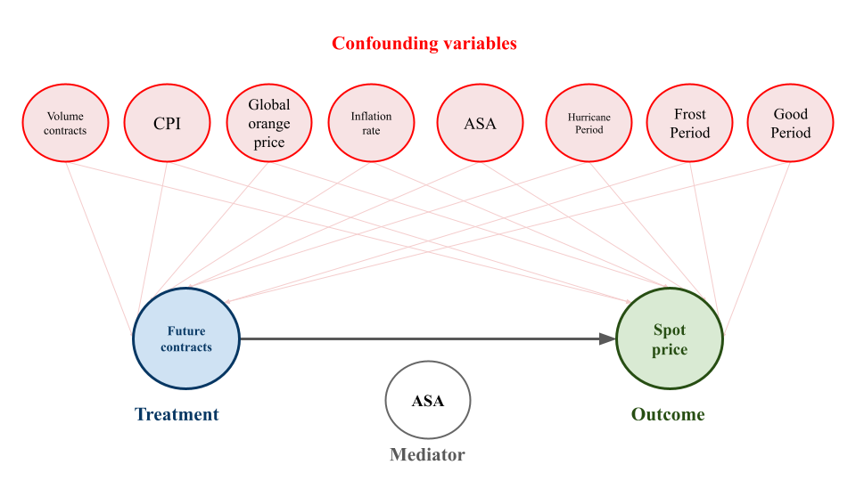

# Overview

This repository contains the code and data necessary to replicate the results of the paper:

**Speculation, Price Transmission, and Efficiency in the Orange Juice Market: A Causal Machine Learning Approach**

## Summary

This study examines the complex role of speculation in the transmission of price signals in the U.S. Frozen Concentrated Orange Juice (FCOJ) market — a highly volatile market influenced by exogenous shocks such as extreme weather and citrus greening disease. These factors introduce non-linear dynamics and heterogeneous speculative behavior that challenge traditional analytical methods.

To address these challenges, we adopt a **Causal Machine Learning** approach using **Double Machine Learning (DML)** to estimate **Conditional Average Treatment Effects (CATEs)**. In our framework:

- **Treatment**: Futures prices  
- **Outcome**: Spot prices  
- **Heterogeneity**: Speculative intensity (proxied by non-commercial open interest)

### Key Findings

- **Moderate speculation** leads to efficient price transmission (*CATE ≈ 1*)
- **Low speculation** amplifies price responses (*CATE > 1*)
- **High speculation** results in insignificant effects, suggesting potential market distortions

These results challenge the common assumption that speculation uniformly improves market efficiency, especially in thin commodity markets like FCOJ.

---

# Datasets

The repository includes the following data files:

1. **`oj_data.xlsx`**  
   Contains the full dataset used in the causal analysis, including:
   - Futures contracts and trading volumes (https://ca.finance.yahoo.com/quote/OJ%3DF/)
   - Average consumer prices of orange juice: FRED - APU0000713111 (https://fred.stlouisfed.org/series/APU0000713111)
   - Consumer Price Index for All Urban Consumers (CPI): FRED – CUUR0000SAF114 (https://fred.stlouisfed.org/series/CUUR0000SAF114)
   - Global orange prices: FRED – PORANGUSDM (https://fred.stlouisfed.org/series/PORANGUSDM)
   - General inflation: FRED – FPCPITOTLZGUSA (https://fred.stlouisfed.org/series/FPCPITOTLZGUSA)
   - Speculative indicators: SNPI, NSP, ASA, Long MM, Short MM (https://www.cftc.gov/MarketReports/CommitmentsofTraders/HistoricalCompressed/index.htm)

2. **`cot.xls`**  
   Contains Commitments of Traders (COT) data for the year 2016, from the CFTC, across all markets (https://www.cftc.gov/MarketReports/CommitmentsofTraders/HistoricalCompressed/index.htm).

3. **`causal_inference_robustness_results.json`**  
   Contains robustness check results for the CATE estimates under different model configurations.

# Code

The core analysis is implemented in a python notebook included in this repository. This notebook reproduces all steps of the empirical work, from data preprocessing and modeling to estimation, validation, and visualization of results.

---

# License

This project is licensed under the MIT License. See the `LICENSE` file for details.

   

